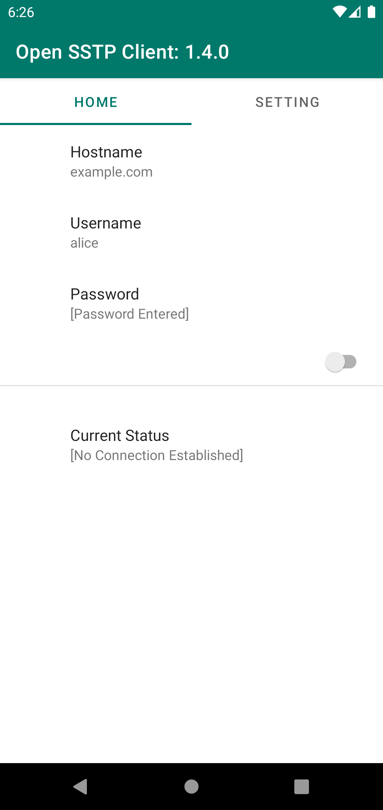
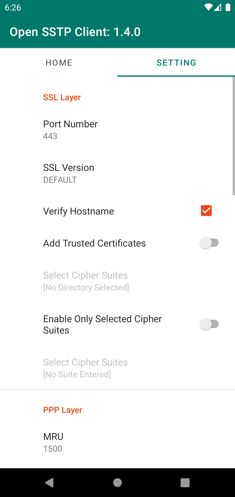

# Open SSTP Client for Android 
This is an open-sourced Secure Socket Tunneling Protocol (MS-SSTP) client for Android, developed for accessing to 
[VPN Azure Cloud](https://www.vpnazure.net/) (or [SoftEther VPN Server](https://www.softether.org/)). 
So no test with other servers is done. Its behavior may be still unstable.

## Installation
You can download and install the latest version via [Google Play](https://play.google.com/store/apps/details?id=kittoku.osc)

## Usage
Enter `Host`, `Username` and `Password` preferences and turn the switch on. If a key icon gets to show on 
the right side of the status bar, establishing a VPN connection has been succeeded. To disconnect 
the connection, turn the switch off in the home tab or tap the notification.  
 

## Setting tab
Some settings to be noted are written below:

### Add Trusted Certificates (SSL Layer)
If you choose a certain directory, the client uses ONLY certificates in the directory, but the default 
certificate store. I made this option for debugging. 

### PPP Network Protocol
You can choose what network protocol PPP layer tries enabling. Remember, IPv6 option just gives the device 
a link local address, never guarantees that you can communicate perfectly with IPv6 protocol.

## Notice
* `Host` preference can also contain IP address, but cannot include a port number. You can configure it in
the setting tab.

* Your device needs to install a self-signed certificate and
 disable `Verify Hostname` option to access to a server using it
 
* A server must enable DHCP
 
* Only **PAP** and **MS-CHAPv2** authentication protocols can be enabled. No EAP. 
 
## Debugging
It is almost impossible that I can debug a problem caused in any environments but my own. In a networking
app, there are many possible reasons to cause the problem and I cannot identify the real one unless the 
problem can be reproduced in my environment.

So it is strongly encouraged that you should debug by yourself. With `Select Cipher Suites` option, this client tries 
to use `TLS_RSA_WITH_AES_128_CBC_SHA` or `TLS_RSA_WITH_AES_256_CBC_SHA` as a cipher suite so that you 
can decrypt and investigate packets with software like WireShark. I think there can be a similar app for 
Android. Don't forget the great software, Android Studio and its emulator (v^ー°)

I don't have Windows Server OS. So I don't officially support accessing to it, but there is a
 successful case. See [this issue](https://github.com/kittoku/Open-SSTP-Client/issues/8#issuecomment-590241322).

## License
Licensed under MIT. Be sure you use this software at your own risk. 
